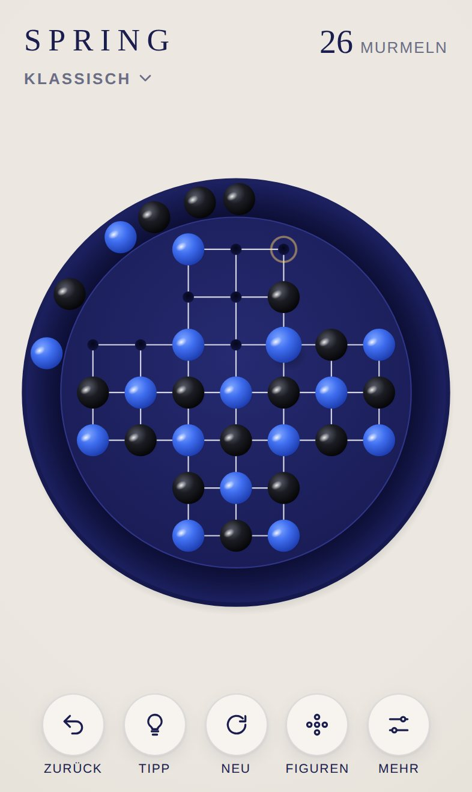
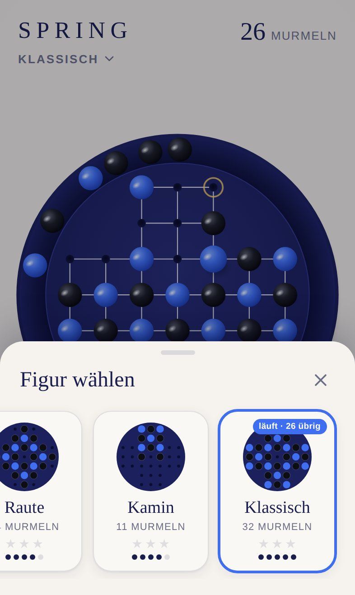
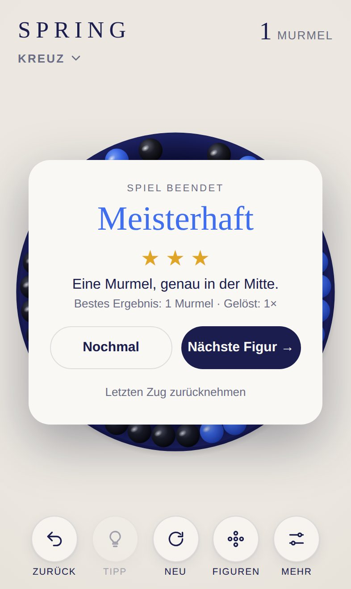

<div align="center">

# SPRING

**Das klassische Solohalma für iPhone und iPad.**

33 Felder. 32 Murmeln. Ein Ziel: eine einzige Murmel, genau in der Mitte.

[**▶ Jetzt spielen**](https://michaeldobner.github.io/solohalma/) · [English](README.md) · [Dokumentation](docs/de/README.md) · [Changelog](CHANGELOG.de.md)

[](https://github.com/michaeldobner/solohalma/actions/workflows/tests.yml)

&nbsp;&nbsp;
&nbsp;&nbsp;


</div>

## Warum SPRING

SPRING macht aus dem alten Holzbrettspiel ein ruhiges, fast greifbares Erlebnis. Ein rundes, tiefblaues Brett, glänzende blaue und schwarze Murmeln und Klänge, gestimmt wie ein kleines Instrument. Keine Werbung, kein Konto, kein Tracking. Es öffnet sich im Browser, lässt sich wie eine App auf den Home-Bildschirm legen und funktioniert offline.

## Highlights

| | |
|---|---|
| **7 Figuren** | Vom sanften *Kreuz* mit 6 Murmeln bis zum *Klassisch*-Brett mit 32, jede auf Lösbarkeit geprüft |
| **Jederzeit wechseln** | Die Figur lässt sich mitten im Spiel wechseln. Das Brett baut sich sichtbar um, jede Figur behält ihren eigenen Spielstand |
| **Tipps** | Ein eingebauter Löser zeigt den nächsten richtigen Zug, direkt aus der aktuellen Stellung |
| **Lebendiger Rand** | Geschlagene Murmeln rollen in den Rand. Antippen oder Wischen lässt sie mit echter Physik rollen, anstoßen und zur Ruhe kommen |
| **Neigen** | Optional: iPhone neigen und die Murmeln im Rand rollen bergab |
| **Klangdesign** | Keramik auf Holz in vier Schichten, gestimmt auf eine pentatonische Tonleiter, die mit dem Fortschritt steigt. Drei Klangfarben: Warm, Klar, Weich |
| **Sterne** | Bis zu drei Sterne pro Figur, bestes Ergebnis und Anzahl der Lösungen werden gespeichert |
| **Zweisprachig** | Deutsch auf deutsch eingestellten Geräten, sonst Englisch |
| **Für Apple-Geräte gemacht** | iPhone hoch und quer, iPad mit fester Seitenleiste, Hell- und Dunkelmodus, respektiert den Lautlos-Schalter |

## So wird gespielt

1. Eine Murmel springt **waagerecht oder senkrecht** über eine benachbarte Murmel auf ein freies Feld.
2. Die übersprungene Murmel wird entfernt und rollt in den Rand.
3. Das Spiel endet, wenn kein Sprung mehr möglich ist.

**Ziel:** eine Murmel übrig lassen, am besten in der Mitte. Alle Regeln, Bewertung und Tipps: [Spielregeln](docs/de/spielregeln.md).

## Auf iPhone oder iPad installieren

1. **https://michaeldobner.github.io/solohalma/** in **Safari** öffnen.
2. Auf **Teilen** tippen, dann **Zum Home-Bildschirm**.
3. Fertig. SPRING startet im Vollbild wie eine App und funktioniert auch ohne Internet.

## Dokumentation

| Dokument | Inhalt |
|---|---|
| [Spielregeln](docs/de/spielregeln.md) | Regeln, Figuren, Bewertung, Bedienung, Tipps, Rand und Neigen |
| [Design-System](docs/de/design.md) | Farben, Typografie, Brettgeometrie, Bewegung, Layouts |
| [Klangdesign](docs/de/klang.md) | Klangschichten, Stimmung, Mischung, Klangfarben |
| [Architektur](docs/de/architektur.md) | Module, Datenmodell, Physik im Rand, Löser, Ablauf eines Zugs |
| [Entwicklung](docs/de/entwicklung.md) | Lokal starten, Tests, Konventionen, Testen auf dem iPhone |
| [Erweitern](docs/de/erweitern.md) | Neue Figuren, Farbthemen, neue Sprachen, Roadmap |
| [Deployment](docs/de/deployment.md) | GitHub Pages, Veröffentlichung, Offline-Cache, Fehlerbehebung |

## Schnellstart für Entwicklung

```bash
npm start   # lokaler Server
npm test    # 26 automatische Tests
```

Keine Abhängigkeiten, kein Build-Schritt. Reines HTML, CSS und JavaScript-Module.

## Technik

| Bereich | Umsetzung |
|---|---|
| Sprache | HTML, CSS, JavaScript (ES-Module) |
| Grafik | SVG, gestochen scharf auf jedem Display |
| Klang | Web Audio API, live erzeugt, keine Audiodateien |
| Tipps | Löser mit Tiefensuche in einem Web Worker |
| Offline | Service Worker und Web App Manifest |
| Speicherung | `localStorage` auf dem Gerät |
| Hosting | GitHub Pages, direkt aus `main` |
| Tests | Node.js Test-Runner, bei jedem Push |

## Projektstruktur

```
├─ index.html              Einstiegsseite
├─ css/style.css           Layout, Farben, Hell- und Dunkelmodus
├─ js/
│  ├─ main.js              verbindet alle Teile
│  ├─ figures.js           die 7 Figuren als Daten
│  ├─ game.js              Spiellogik
│  ├─ view.js              Brett, Animationen, Touch-Eingabe
│  ├─ gutter.js            Physik im Rand
│  ├─ sound.js             Klang-Engine
│  ├─ solver.js            Löser für Tipps
│  ├─ solver-worker.js     rechnet den Löser im Hintergrund
│  ├─ tilt.js              Bewegungssensor
│  ├─ i18n.js              Deutsch und Englisch
│  └─ storage.js           Speicherung auf dem Gerät
├─ icons/                  App-Symbole
├─ sw.js                   Offline-Betrieb
├─ manifest.webmanifest    Installation als App
├─ tests/                  automatische Tests
└─ docs/                   Dokumentation (de, en, Bilder)
```

## Version

Aktuelle Version: **2.0.0**. Siehe [Changelog](CHANGELOG.de.md).
