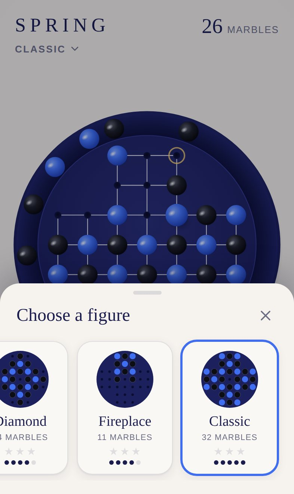
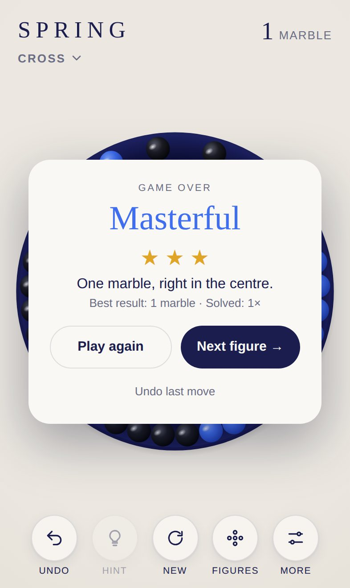

<div align="center">

# SPRING

**The classic peg solitaire for iPhone and iPad.**

33 holes. 32 marbles. One goal: a single marble, right in the centre.

[**▶ Play now**](https://michaeldobner.github.io/solohalma/) · [Deutsch](README.de.md) · [Documentation](docs/en/README.md) · [Changelog](CHANGELOG.md)

[](https://github.com/michaeldobner/solohalma/actions/workflows/tests.yml)

&nbsp;&nbsp;
&nbsp;&nbsp;


</div>

## Why SPRING

SPRING turns the old wooden board game into a calm, tactile experience. A round, deep blue board, glossy blue and black marbles, and sounds tuned like a small instrument. No ads, no accounts, no tracking. It opens in the browser, installs to the home screen like an app and works offline.

## Highlights

| | |
|---|---|
| **7 figures** | From the gentle *Cross* with 6 marbles to the *Classic* board with 32, every one verified as solvable |
| **Switch any time** | Change the figure during play. The board rebuilds itself and a new game begins |
| **Hints** | A built-in solver shows the next correct move, right from the current position |
| **Living rim** | Captured marbles roll into the rim. Tap or swipe them and they roll, bump and settle with real physics |
| **Tilt** | Optional: tilt your iPhone and the marbles in the rim roll downhill |
| **Sound design** | Ceramic on wood in four layers, tuned to a pentatonic scale that rises with your progress. Three styles: Warm, Clear, Soft |
| **Stars** | Up to three stars per figure, best result and number of solves are saved |
| **Bilingual** | German on German devices, English everywhere else |
| **Made for Apple devices** | iPhone portrait and landscape, iPad with a permanent sidebar, light and dark mode, respects the silent switch |

## How to play

1. A marble jumps **horizontally or vertically** over a neighbouring marble into an empty hole.
2. The marble jumped over is removed and rolls into the rim.
3. The game ends when no more jumps are possible.

**Goal:** leave one marble, ideally in the centre. Full rules, scoring and tips: [Gameplay](docs/en/gameplay.md).

## Install on iPhone or iPad

1. Open **https://michaeldobner.github.io/solohalma/** in **Safari**.
2. Tap **Share**, then **Add to Home Screen**.
3. Done. SPRING opens full screen like an app and also works without internet.

## Documentation

| Document | Contents |
|---|---|
| [Gameplay](docs/en/gameplay.md) | Rules, figures, scoring, controls, hints, rim and tilt |
| [Design system](docs/en/design.md) | Colours, typography, board geometry, motion, layouts |
| [Sound design](docs/en/sound.md) | Sound layers, tuning, mix levels, sound styles |
| [Architecture](docs/en/architecture.md) | Modules, data model, rim physics, solver, flow of a move |
| [Development](docs/en/development.md) | Local setup, tests, conventions, testing on iPhone |
| [Extending](docs/en/extending.md) | New figures, colour themes, new languages, roadmap |
| [Deployment](docs/en/deployment.md) | GitHub Pages, releases, offline cache, troubleshooting |

## Quick start for developers

```bash
npm start   # local server
npm test    # 30 automated tests
```

No dependencies, no build step. Plain HTML, CSS and JavaScript modules.

## Tech

| Area | Implementation |
|---|---|
| Language | HTML, CSS, JavaScript (ES modules) |
| Graphics | SVG, sharp on every display |
| Sound | Web Audio API, synthesised live, no audio files |
| Hints | Depth first solver in a Web Worker |
| Offline | Service worker and web app manifest |
| Storage | `localStorage` on the device |
| Hosting | GitHub Pages, served straight from `main` |
| Tests | Node.js test runner, run on every push |

## Project structure

```
├─ index.html              entry page
├─ css/style.css           layout, colours, light and dark mode
├─ js/
│  ├─ main.js              wires everything together
│  ├─ figures.js           the 7 figures as data
│  ├─ game.js              game logic
│  ├─ view.js              board, animations, touch input
│  ├─ gutter.js            rim physics
│  ├─ sound.js             sound engine
│  ├─ solver.js            solver for hints
│  ├─ solver-worker.js     runs the solver in the background
│  ├─ tilt.js              motion sensor
│  ├─ i18n.js              German and English
│  └─ storage.js           saving on the device
├─ icons/                  app icons
├─ sw.js                   offline support
├─ manifest.webmanifest    install as an app
├─ scripts/release.mjs     sets a new version everywhere
├─ tests/                  automated tests
└─ docs/                   documentation (de, en, images)
```

## Version

Current version: **2.0.2**. See the [changelog](CHANGELOG.md).
