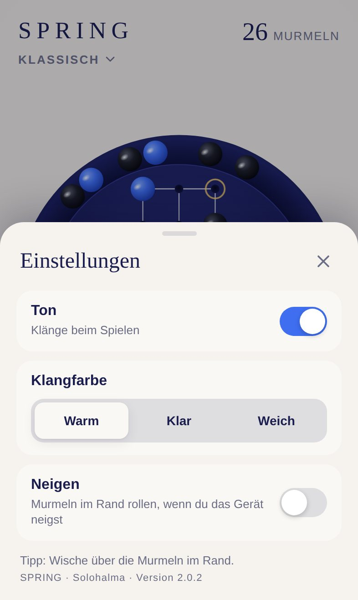
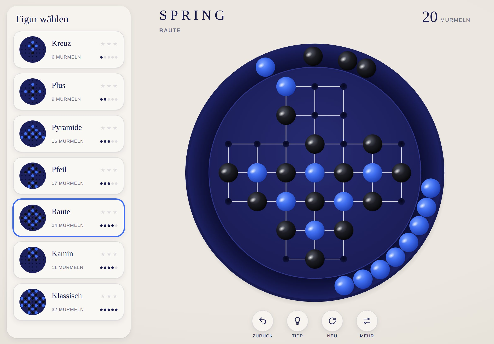

# SPRING · Dokumentation

[English version](../en/README.md) · [Zurück zum Projekt](../../README.de.md)

Diese Dokumentation beschreibt SPRING vollständig: wie man spielt, wie es aussieht und klingt, wie es aufgebaut ist und wie man es weiterentwickelt und veröffentlicht.

| Dokument | Inhalt | Für wen |
|---|---|---|
| [Spielregeln](spielregeln.md) | Regeln, Figuren, Bewertung, Bedienung, Tipps, Rand und Neigen, Installation | Alle |
| [Design-System](design.md) | Farben, Typografie, Brettgeometrie, Bewegung, Layouts für iPhone und iPad | Design, Entwicklung |
| [Klangdesign](klang.md) | Aufbau der Klänge, Stimmung, Mischung, Klangfarben | Design, Entwicklung |
| [Architektur](architektur.md) | Module, Datenmodell, Physik im Rand, Löser, Ablauf eines Zugs | Entwicklung |
| [Entwicklung](entwicklung.md) | Lokal starten, Tests, Konventionen, Testen auf dem iPhone | Entwicklung |
| [Erweitern](erweitern.md) | Neue Figuren, Farbthemen, neue Sprachen, Roadmap | Entwicklung |
| [Deployment](deployment.md) | GitHub Pages, Veröffentlichung, Offline-Cache, Fehlerbehebung | Betrieb |

## SPRING auf einen Blick

| | |
|---|---|
| Spiel | Solohalma (Solitär) auf dem englischen Kreuzbrett mit 33 Feldern |
| Inhalt | 7 Figuren von leicht bis schwer, Tipps, Sterne, Statistik |
| Plattform | Progressive Web App für iPhone und iPad, läuft in jedem modernen Browser |
| Sprachen | Deutsch und Englisch, automatisch nach Gerätesprache |
| Technik | HTML, CSS, JavaScript-Module, SVG, Web Audio, kein Framework, kein Build-Schritt |
| Betrieb | GitHub Pages, offline spielbar |
| Adresse | https://michaeldobner.github.io/solohalma/ |
| Version | 2.0.2 |

&nbsp;

