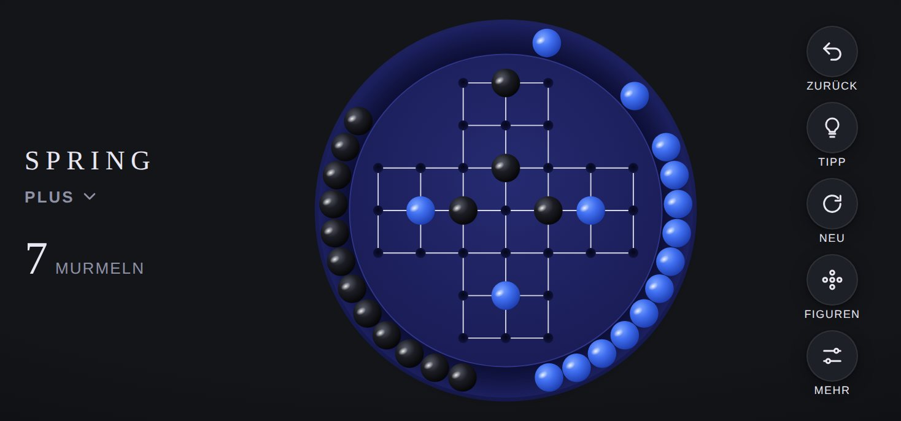

# Design-System

[English version](../en/design.md) · [Übersicht](README.md)

## Leitidee

Das Brett wirkt wie ein hochwertiges Objekt, das auf dem Tisch liegt: rund, tiefblau, mit erhöhtem Rand und glänzenden Murmeln. Die Oberfläche darum bleibt ruhig, damit das Brett im Mittelpunkt steht.

| Grundsatz | Bedeutung |
|---|---|
| **Reduktion** | Ein Schriftzug, ein Zähler, fünf Schaltflächen. Alles Weitere liegt in Blättern, die nur bei Bedarf erscheinen |
| **Greifbarkeit** | Licht, Schatten und Physik lassen die Murmeln wie echte Objekte wirken |
| **Ruhe** | Kurze, weiche Bewegungen. Nichts blinkt, nichts bewegt sich von selbst |
| **Klarheit** | Gültige Ziele sind immer sichtbar, sobald eine Murmel ausgewählt ist |
| **Verlässlichkeit** | Kein Fortschritt geht verloren, deshalb braucht kaum eine Aktion eine Rückfrage |

## Farben

### Brett und Murmeln (gleich in Hell und Dunkel)

| Element | Farbe | Verwendung |
|---|---|---|
| Brett außen | `#2a2f7a` → `#14174a` | Radialer Verlauf, Licht von oben |
| Rinne | `#0b0d33` → `#1c2060` | Vertiefung zwischen Rand und Spielfläche |
| Spielfläche | `#262b72` → `#191c55` | Innere Scheibe |
| Kante Spielfläche | `#2f3588` | Feine Lichtkante |
| Linien | Weiß, 82 % | Verbindungen zwischen benachbarten Feldern |
| Mulden | `#05061c` → `#11143f` | Freie Felder |
| Murmel blau | `#7fa6ff`, `#3f6ef0`, `#1d3cae` | Lichtpunkt, Körper, Schatten |
| Murmel schwarz | `#5a5d6a`, `#1c1d24`, `#050507` | Lichtpunkt, Körper, Schatten |
| Zielring | Weiß, gestrichelt, pulsierend | Gültige Ziele |
| Tippring | `#ffd36b`, durchgezogen | Vom Löser empfohlenes Ziel |

### Oberfläche (CSS-Variablen in `css/style.css`)

| Variable | Hell | Dunkel | Verwendung |
|---|---|---|---|
| `--bg` | `#ece8e1` | `#141519` | Hintergrund |
| `--bg-edge` | `#e2ddd4` | `#0d0e11` | Vignette am Rand |
| `--ink` | `#1a1d4e` | `#e9e7f2` | Text und Symbole |
| `--ink-soft` | `#6b6d85` | `#8f91a6` | Nebentexte |
| `--btn` | `#f7f4ef` | `#1e2027` | Schaltflächen |
| `--card` | `#faf8f4` | `#1e2027` | Karten, Einstellungszeilen |
| `--sheet` | `#f6f3ee` | `#1b1d23` | Blätter und Seitenleiste |
| `--accent` | `#3f6ef0` | `#3f6ef0` | Aktive Figur, Schalter, „Meisterhaft“ |
| `--star` | `#e0a526` | `#e0a526` | Erreichte Sterne |
| `--hint` | `#ffd36b` | `#ffd36b` | Tippring |

Der Modus folgt automatisch der Systemeinstellung.

## Typografie

| Rolle | Schrift | Stil |
|---|---|---|
| Schriftzug SPRING, Zahlen, Überschriften | Didot, Bodoni 72, Ersatz Georgia | Schriftzug mit Laufweite 0,22 em |
| Figurenname im Kopf | Systemschrift | Großbuchstaben, halbfett, Laufweite 0,12 em |
| Text und Beschriftungen | San Francisco (Systemschrift) | Beschriftungen in Großbuchstaben, Laufweite 0,06 bis 0,16 em |

Alle Schriften sind auf Apple-Geräten vorinstalliert. Es werden keine Webfonts geladen.

## Geometrie des Bretts

Das Brett ist ein SVG mit festem Koordinatensystem von 1000 × 1000 Einheiten und skaliert verlustfrei.

| Element | Wert |
|---|---|
| Radius Brett | 494 |
| Rinne außen, innen | 484, 408 |
| Kreisbahn der Murmeln im Rand | 446 |
| Radius Spielfläche | 404 |
| Abstand der Felder | 110 |
| Radius Murmel | 37 |
| Radius Mulde | 13 |
| Linienstärke | 3 |

Feld `(Zeile r, Spalte c)` liegt bei `x = 500 + (c − 3) × 110`, `y = 500 + (r − 3) × 110`. Im Rand haben bis zu 37 Murmeln Platz, gebraucht werden höchstens 31.

## Bewegung

| Ereignis | Dauer | Verhalten |
|---|---|---|
| Murmel anheben | 140 ms | 12 % größer, Schatten wandert nach unten und wird weicher |
| Sprung nach Tippen | 280 ms | Bogen über die übersprungene Murmel |
| Sprung nach Ziehen | 170 ms | Gleitet vom Loslassen ins Ziel |
| Geschlagene Murmel | 420 ms | Rollt zur nächsten freien Stelle im Rand, die Nachbarn ruckeln sich zurecht |
| Figur wechseln | etwa 460 ms je Murmel, leicht versetzt | Murmeln springen zwischen Rand und Brett |
| Zurück | 260 bis 340 ms | Beide Murmeln kehren gleichzeitig zurück |
| Ungültige Murmel | 260 ms | Kurzes seitliches Wackeln |
| Zielringe | 1,4 s Schleife | Pulsieren sanft |
| Blätter | 420 ms | Federnde Kurve wie in iOS |
| Murmeln im Rand | bis etwa 1,5 s | Physik mit Reibung, siehe [Architektur](architektur.md#physik-im-rand) |

Alle Animationen nutzen weiches Beschleunigen und Abbremsen. Ist auf dem Gerät „Bewegung reduzieren“ aktiv, springen Murmeln ohne Animation an ihr Ziel.

## Layouts

| Situation | Anordnung |
|---|---|
| iPhone hoch | Schriftzug, Figurenname und Zähler oben, Brett mittig, fünf Schaltflächen unten. Figuren und Einstellungen als Blätter von unten |
| iPhone quer (Höhe unter 500 px) | Schriftzug und Zähler links, Brett mittig, Schaltflächen rechts übereinander. Figuren als Schublade von links |
| iPad hoch | Wie iPhone hoch, mit mehr Platz um das Brett |
| iPad quer (ab 1000 px Breite) | Feste Seitenleiste mit allen Figuren links, Brett und Steuerung rechts. Die Schaltfläche Figuren entfällt |

Weitere Regeln:

* Das Brett ist höchstens 820 px groß und füllt sonst den verfügbaren Platz.
* Abstände berücksichtigen Notch, Dynamic Island und Home-Indikator (`env(safe-area-inset-*)`), mindestens 16 px seitlich.
* Schaltflächen sind 52 px groß (quer 42 px), Tippflächen nie unter 44 pt.
* Zoomen, Textauswahl und das Kontextmenü bei langem Drücken sind abgeschaltet.

## Komponenten

| Komponente | Beschreibung |
|---|---|
| Figurenkarte | Mini-Brett, Name, Zahl der Murmeln, Sterne, fünf Schwierigkeitspunkte, Abzeichen „läuft“. Aktive Figur mit blauem Rahmen |
| Blatt | Abgerundet, mit Griff oben, schließt per Wischen nach unten, Tipp daneben oder Kreuz |
| Schalter | iOS-typischer Schalter, aktiv in `--accent` |
| Segmentauswahl | Drei gleich breite Felder für die Klangfarbe |
| Ergebniskarte | Bewertung, Sterne, Text, Statistik, zwei Schaltflächen und ein Textlink |
| Hinweisleiste | Dunkle Leiste unten im Brett für Meldungen des Lösers und des Sensors |
| Erststart-Hinweis | Sprechblase unter dem Figurennamen, erscheint nur einmal |

## App-Symbol

Ausschnitt des Bretts: neun Felder im Quadrat, Mitte frei, blaue Murmeln in den Ecken, schwarze an den Seiten, auf dunkelblauem Grund. Quelle ist `icons/icon.svg`, daraus entstehen PNG-Dateien in 180, 192 und 512 Pixeln.
