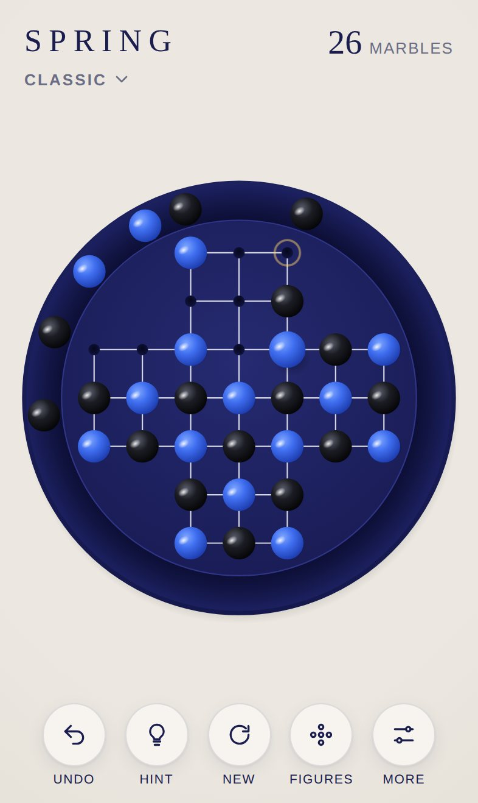
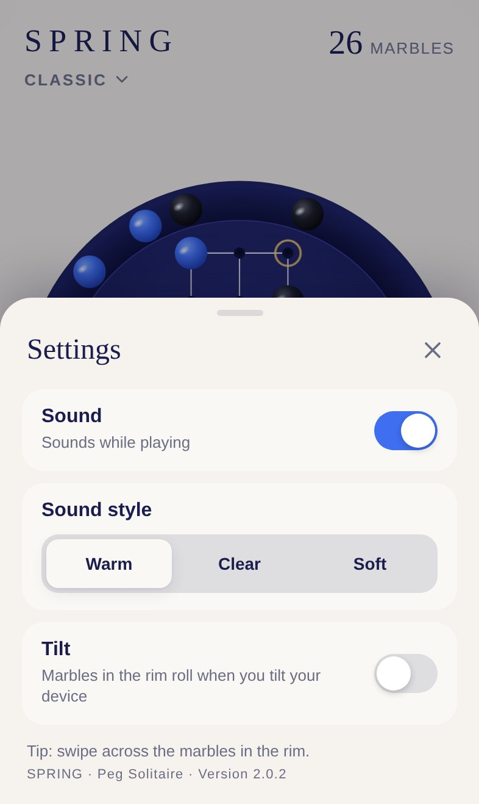
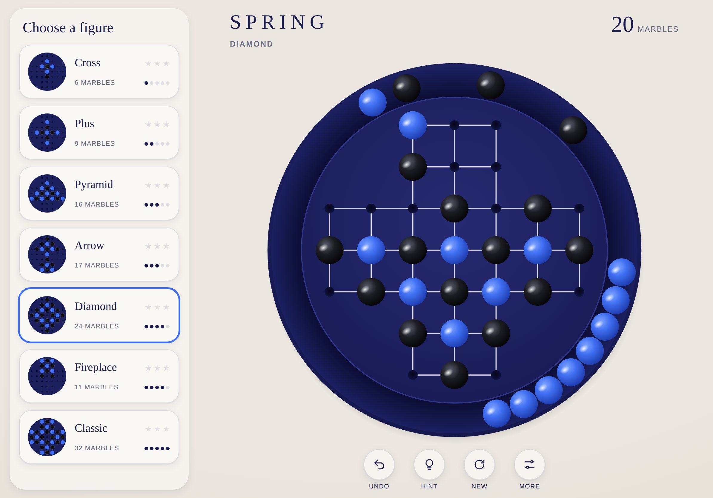

# SPRING · Documentation

[Deutsche Version](../de/README.md) · [Back to the project](../../README.md)

This documentation describes SPRING completely: how to play, how it looks and sounds, how it is built and how to develop and publish it.

| Document | Contents | Audience |
|---|---|---|
| [Gameplay](gameplay.md) | Rules, figures, scoring, controls, hints, rim and tilt, installation | Everyone |
| [Design system](design.md) | Colours, typography, board geometry, motion, layouts for iPhone and iPad | Design, development |
| [Sound design](sound.md) | How the sounds are built, tuning, mix, sound styles | Design, development |
| [Architecture](architecture.md) | Modules, data model, rim physics, solver, flow of a move | Development |
| [Development](development.md) | Local setup, tests, conventions, testing on iPhone | Development |
| [Extending](extending.md) | New figures, colour themes, new languages, roadmap | Development |
| [Deployment](deployment.md) | GitHub Pages, releases, offline cache, troubleshooting | Operations |

## SPRING at a glance

| | |
|---|---|
| Game | Peg solitaire on the English 33-hole board |
| Content | 7 figures from easy to hard, hints, stars, statistics |
| Platform | Progressive web app for iPhone and iPad, runs in any modern browser |
| Languages | German and English, chosen automatically from the device language |
| Tech | HTML, CSS, JavaScript modules, SVG, Web Audio, no framework, no build step |
| Hosting | GitHub Pages, playable offline |
| Address | https://michaeldobner.github.io/solohalma/ |
| Version | 2.0.2 |

&nbsp;

