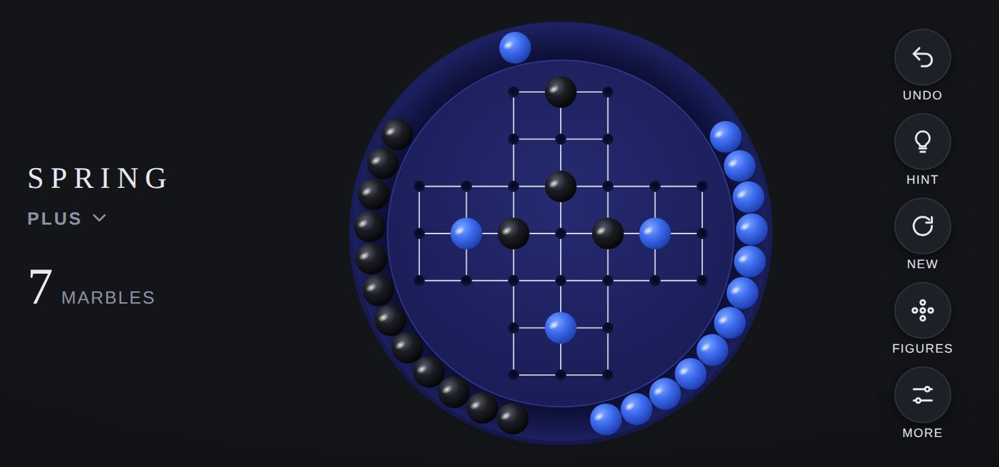

# Design system

[Deutsche Version](../de/design.md) · [Overview](README.md)

## Guiding idea

The board looks like a fine object lying on a table: round, deep blue, with a raised rim and glossy marbles. The interface around it stays calm so the board is the centre of attention.

| Principle | Meaning |
|---|---|
| **Reduction** | One wordmark, one counter, five buttons. Everything else lives in sheets that appear only when needed |
| **Tactility** | Light, shadow and physics make the marbles feel like real objects |
| **Calm** | Short, soft motion. Nothing blinks, nothing moves on its own |
| **Clarity** | Valid targets are always visible as soon as a marble is selected |
| **Trust** | No progress is ever lost, so almost no action needs a confirmation |

## Colours

### Board and marbles (same in light and dark)

| Element | Colour | Use |
|---|---|---|
| Board outer | `#2a2f7a` → `#14174a` | Radial gradient, light from above |
| Rim groove | `#0b0d33` → `#1c2060` | Groove between edge and playing surface |
| Playing surface | `#262b72` → `#191c55` | Inner disc |
| Surface edge | `#2f3588` | Fine highlight |
| Lines | White, 82 % | Connections between neighbouring holes |
| Holes | `#05061c` → `#11143f` | Empty holes |
| Blue marble | `#7fa6ff`, `#3f6ef0`, `#1d3cae` | Highlight, body, shadow |
| Black marble | `#5a5d6a`, `#1c1d24`, `#050507` | Highlight, body, shadow |
| Target ring | White, dashed, pulsing | Valid targets |
| Hint ring | `#ffd36b`, solid | Target recommended by the solver |

### Interface (CSS variables in `css/style.css`)

| Variable | Light | Dark | Use |
|---|---|---|---|
| `--bg` | `#ece8e1` | `#141519` | Background |
| `--bg-edge` | `#e2ddd4` | `#0d0e11` | Edge vignette |
| `--ink` | `#1a1d4e` | `#e9e7f2` | Text and icons |
| `--ink-soft` | `#6b6d85` | `#8f91a6` | Secondary text |
| `--btn` | `#f7f4ef` | `#1e2027` | Buttons |
| `--card` | `#faf8f4` | `#1e2027` | Cards, settings rows |
| `--sheet` | `#f6f3ee` | `#1b1d23` | Sheets and sidebar |
| `--accent` | `#3f6ef0` | `#3f6ef0` | Current figure, switches, "Masterful" |
| `--star` | `#e0a526` | `#e0a526` | Stars earned |
| `--hint` | `#ffd36b` | `#ffd36b` | Hint ring |

The mode follows the system setting automatically.

## Typography

| Role | Typeface | Style |
|---|---|---|
| SPRING wordmark, numbers, headings | Didot, Bodoni 72, fallback Georgia | Wordmark tracked at 0.22 em |
| Figure name in the header | System font | Upper case, semibold, tracked at 0.12 em |
| Text and labels | San Francisco (system font) | Labels in upper case, tracked 0.06 to 0.16 em |

All typefaces ship with Apple devices. No web fonts are loaded.

## Board geometry

The board is an SVG with a fixed coordinate system of 1000 × 1000 units and scales without loss.

| Element | Value |
|---|---|
| Board radius | 494 |
| Rim groove outer, inner | 484, 408 |
| Circle the rim marbles travel on | 446 |
| Playing surface radius | 404 |
| Hole spacing | 110 |
| Marble radius | 37 |
| Hole radius | 13 |
| Line width | 3 |

Hole `(row r, column c)` sits at `x = 500 + (c − 3) × 110`, `y = 500 + (r − 3) × 110`. The rim has room for up to 37 marbles, at most 31 are ever needed.

## Motion

| Event | Duration | Behaviour |
|---|---|---|
| Lift a marble | 140 ms | 12 % larger, shadow moves down and softens |
| Jump after tap | 280 ms | Arc over the marble being jumped |
| Jump after drag | 170 ms | Glides from the release point into the hole |
| Captured marble | 420 ms | Rolls to the nearest free spot in the rim, neighbours settle |
| Switch figure | about 460 ms per marble, slightly staggered | Marbles jump between rim and board |
| Undo | 260 to 340 ms | Both marbles return at the same time |
| Invalid marble | 260 ms | Short sideways wobble |
| Target rings | 1.4 s loop | Gentle pulse |
| Sheets | 420 ms | Springy curve as in iOS |
| Rim marbles | up to about 1.5 s | Physics with friction, see [Architecture](architecture.md#rim-physics) |

All animations ease in and out. When "Reduce Motion" is on, marbles move to their target without animation.

## Layouts

| Situation | Arrangement |
|---|---|
| iPhone portrait | Wordmark, figure name and counter at the top, board in the middle, five buttons at the bottom. Figures and settings as sheets from the bottom |
| iPhone landscape (height below 500 px) | Wordmark and counter on the left, board in the middle, buttons stacked on the right. Figures as a drawer from the left |
| iPad portrait | Like iPhone portrait, with more space around the board |
| iPad landscape (from 1000 px wide) | Permanent sidebar with all figures on the left, board and controls on the right. The Figures button is hidden |

Further rules:

* The board is at most 820 px and otherwise fills the available space.
* Spacing respects the notch, Dynamic Island and home indicator (`env(safe-area-inset-*)`), at least 16 px at the sides.
* Buttons are 52 px (42 px in landscape), touch targets never below 44 pt.
* Zooming, text selection and the long-press context menu are disabled.

## Components

| Component | Description |
|---|---|
| Figure card | Mini board, name, number of marbles, stars, five difficulty dots, "in progress" badge. Current figure with a blue outline |
| Sheet | Rounded, grabber at the top, closes on swipe down, tap outside or the cross |
| Switch | iOS style switch, active in `--accent` |
| Segmented control | Three equal segments for the sound style |
| Result card | Rating, stars, text, statistics, two buttons and a text link |
| Toast | Dark bar at the bottom of the board for messages from the solver and the sensor |
| First launch hint | Speech bubble below the figure name, shown only once |

## App icon

A detail of the board: nine holes in a square, centre empty, blue marbles in the corners, black ones on the sides, on a deep blue ground. The source is `icons/icon.svg`, from which PNG files in 180, 192 and 512 pixels are rendered.
